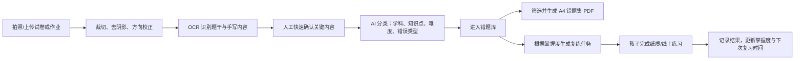
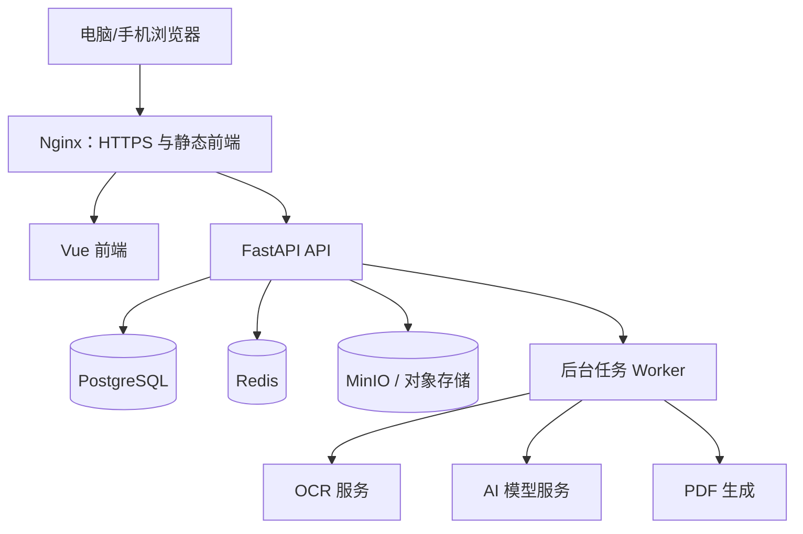

# 错题本（Web）项目方案

## 1. 项目目标

为家长和孩子提供一个可在电脑、平板与手机使用的错题整理工具，把“拍照、整理、抄写、打印、复练”变成一条清晰的流程。系统的核心价值不是单纯存题，而是帮助孩子用有限时间反复练习**真正值得重做的题**。

首要目标：

- 减少手抄错题的时间；
- 可靠地保留原题、答案和解题过程；
- 按学科、知识点、错误原因和难度组织题目；
- 生成适合打印的错题集和针对性练习；
- 按复习节奏提醒孩子重练，并记录是否真正掌握；
- 用 AI 辅助判断题目的复练价值，但始终允许家长/老师修正。

## 2. 用户与使用场景

| 用户 | 典型场景 | 最需要的能力 |
| --- | --- | --- |
| 家长 | 孩子把试卷、作业带回家后，快速拍照归档并打印 | 批量上传、少编辑、快速成册、复习提醒 |
| 孩子 | 按当天任务做错题，查看自己的薄弱点 | 题目清晰、任务简单、反馈即时 |
| 老师/辅导者（后续） | 为一个或多个学生筛选练习 | 批量导入、题组分发、查看掌握情况 |

建议优先优化“家长上传 + 孩子纸上练习”这个主流程，而不是一开始做成完整在线题库或在线课堂。

## 3. 核心业务流程



### 3.1 单题从上传到归档

1. 家长选择孩子、学科，上传一张或多张照片、扫描 PDF。
2. 系统自动裁切题目区域、旋转纠偏、增强文字清晰度；用户可拖拽调整题目边界。
3. 系统保留原图，同时识别题干、选项、答案区域和手写解题过程。
4. 用户只需确认高风险字段：题目范围、正确答案（如有）、所属学科。低置信度识别结果必须标黄，不能悄悄“猜对”。
5. AI 给出建议：知识点、难度星级、错误类型、是否值得反复练习；家长可一键接受或修改。
6. 题目进入错题库，自动排入合适的复习计划。

### 3.2 错题集打印

支持按孩子、学科、知识点、日期、难度、错误类型、待复习状态组合筛选，并生成：

- **练习版**：题目留白，不显示答案和解析；
- **答案版**：题目后附答案/解析，供家长核对；
- **专项版**：例如“分数计算”“三角形面积”“英语时态”；
- **复习任务单**：只包含当前到期且高价值的题；
- **错题原貌版**：保留题目原图，适合 OCR 尚未完全确认或含图形题的情况。

PDF 使用 A4 模板，自动分页、控制图片清晰度，并可在题目旁放二维码/编号，便于练完后扫码回到原题和答案。

## 4. 功能范围与优先级

### 第一阶段：可用的最小版本（MVP）

| 模块 | 功能 | 说明 |
| --- | --- | --- |
| 账户与孩子档案 | 家长账户、多个孩子、年级、学科 | 先按家庭使用设计 |
| 错题上传 | 手机拍照、电脑上传、批量上传、图片/PDF | 每题保留原始图片 |
| 图片处理 | 旋转、裁切、透视矫正、去阴影、压缩 | 直接决定 OCR 和打印质量 |
| 题目管理 | 题目标题、学科、来源、日期、标签、星级、备注 | 支持人工编辑与搜索 |
| OCR 辅助 | 识别印刷文字；识别结果可编辑、置信度提示 | 手写内容先“辅助识别 + 原图保留” |
| AI 分类 | 知识点、难度、错误类型、复练价值建议 | AI 结果不是最终裁决 |
| 错题集 | 筛选、排序、A4 PDF 导出、练习/答案两种版式 | 第一版应优先保证打印稳定 |
| 复习计划 | 到期提醒、完成记录、重新排期 | 采用简单的间隔复习算法 |

### 第二阶段：提高学习效果

- 看板：按知识点、错误类型、难度展示薄弱项和改善趋势；
- 更细的错因：概念不清、审题、计算、书写、粗心、方法选择不当；
- 在线复练和拍照提交；
- 题目去重、相似题聚类；
- 由错题自动生成“同知识点、不同数字/语境”的变式练习；
- 家长端周报、打印提醒和完成提醒。

### 第三阶段：复杂题批改与协作

- 数学计算题按步骤检查，定位第一处可能出错的步骤；
- 语文阅读/作文、英语翻译等主观题的分项评价；
- 老师账号、班级、题组分享；
- 题库导入、试卷结构化拆题；
- 多端通知（微信服务通知、邮件或应用内通知，需在产品上线时另行确认）。

## 5. “哪些错题值得重做”的判断

建议将“难度星级”和“复练价值”分开，避免把难题自动等同于高价值题。

### 5.1 难度星级（1–5 星）

难度可由 AI 初评，再由答题表现持续校正：

- 1 星：基础记忆或单步题；
- 2 星：基础应用，规则明确；
- 3 星：需要两三个步骤或综合一个知识点；
- 4 星：综合题、易混淆题或需要建模；
- 5 星：压轴、开放题或需要多种方法的题。

### 5.2 复练价值（高/中/低）

首版可采用透明的规则评分，AI 只负责提取特征和给出解释。

| 信号 | 对复练价值的影响 |
| --- | --- |
| 同一知识点近期多次出错 | 明显提高 |
| 概念、方法、审题错误 | 提高 |
| 一次性计算失误，且重做已正确 | 降低 |
| 题目可代表一类题型 | 提高 |
| 题目太偏、太长、与当前年级脱节 | 降低 |
| 复练后仍然错误 | 显著提高，并缩短下次间隔 |

示例：一道因抄错数字而错的口算题，可标记为“低价值，正确重做一次后归档”；一道反复混淆单位换算的题，即使不难，也应标记为“高价值，安排多次变式复练”。

系统应显示“为什么这样建议”，例如：`同知识点近 14 天第 3 次出错；属于概念混淆；建议 1 天后复练`。家长可覆盖 AI 建议，覆盖结果可作为后续优化依据。

## 6. OCR、手写与 AI 的实现策略

### 6.1 OCR 的现实边界

“高准确度”不能只依赖一个通用 OCR。题目中常有分式、根号、几何图、表格、英文、拼音和孩子手写步骤；不同内容应走不同处理方式。

推荐策略：

1. **图像预处理**：自动纠偏、裁切、去阴影、增强对比度，必要时允许手动框选；
2. **印刷题干识别**：使用支持中英文和版面分析的 OCR 服务，输出文字、公式区域、表格区域和坐标；
3. **公式/图形保真**：公式和几何图优先以裁切图片保存，识别文本仅作搜索与辅助编辑，避免公式被 OCR 错改；
4. **手写步骤识别**：先保存步骤原图；模型可转写为候选文本，但不能覆盖原图；
5. **AI 视觉复核**：将原图和 OCR 文本一并交给具备视觉能力的模型做结构化提取、分类与一致性检查；
6. **置信度与人工确认**：关键字段低置信度时明确提醒编辑。系统质量来自“机器先做 80%，人用几秒确认 20%”。

在服务选择上，建议先做一轮真实样本评测：收集数学、语文、英语各 30–50 张，包含打印、扫描、手机拍摄、手写答案、公式和图形。以“题干可直接打印”“关键公式正确”“编辑耗时”作为指标，再决定具体 OCR 服务商或自建模型；不要仅依据宣传准确率采购。

### 6.2 AI 输出应结构化

AI 不直接返回一段随意的评价，而应按固定字段返回并保存版本：

```json
{
  "subject": "数学",
  "grade_range": "小学五年级",
  "knowledge_points": ["分数加减法", "通分"],
  "difficulty_stars": 2,
  "error_type": "计算失误",
  "review_value": "low",
  "reason": "题型基础，复做正确后可降低频率",
  "confidence": 0.82,
  "requires_human_review": false
}
```

对正确答案不明确、图像模糊或判断把握不足的题，AI 必须标记 `requires_human_review: true`，而不是编造结论。

### 6.3 计算题步骤批改

这是很有价值但技术难度最高的部分，建议后置到第三阶段。

- 首先要求或导入参考答案/标准步骤；
- OCR/视觉模型提取孩子每一步表达式，保留对应的图像坐标；
- 使用数学表达式解析和符号计算校验等式变形是否等价；
- 找出第一处不成立、跳步过大或符号错误的位置；
- AI 以“可能在这一步出现问题”为措辞给提示，不能把低置信度判断当作判错；
- 对应用题还需拆分“列式、计算、单位、答句”，分别评估。

首版可先支持“家长勾选错因 + AI 给讲解/相似题”，不承诺自动逐步判卷。这样能更快把最核心的整理和复练体验做扎实。

## 7. 复习调度：记忆曲线如何落地

可使用简化间隔复习（类似 SM-2）作为第一版，而不是写死一条所谓“万能记忆曲线”。每道题维护掌握度、最近结果、复习次数和下次复习时间。

建议初始节奏为：首次归档后第 1、3、7、14、30 天复习；每次完成后按结果动态调整：

- 正确且用时正常：延长下次间隔；
- 正确但犹豫/耗时过长：小幅延长，保留复习；
- 再次错误：缩短间隔，并提高复练价值；
- 连续两次正确且为低价值计算失误：转入低频归档。

任务生成时要控制每日题量，并混合新到期题与旧薄弱题，避免单一知识点刷到疲劳。

## 8. 技术方案

### 8.1 推荐技术栈

| 层级 | 推荐 | 原因 |
| --- | --- | --- |
| 前端 | Vue 3 + TypeScript + Vite + 响应式 UI | 同一套代码适配手机和电脑，生态成熟 |
| 后端 | Python + FastAPI | API 性能好、类型清晰，适合 OCR/AI 任务编排 |
| 异步任务 | Celery 或 RQ + Redis | OCR、AI、PDF 生成不阻塞上传页面 |
| 主数据库 | PostgreSQL | 多用户、筛选统计、任务调度、未来扩展更稳妥 |
| 本地开发 | SQLite | 安装简单，可用于开发/演示，但不建议作为正式多用户部署库 |
| 图片/文件 | 开发环境本地卷；生产环境 MinIO/S3 | 原图、裁切图、PDF 与数据库分离，便于备份 |
| PDF | HTML 模板 + 浏览器渲染成 PDF | A4 排版可控，前端预览与打印一致 |
| 部署 | Docker Compose + Nginx | 一键部署，便于迁移与更新 |

**数据库结论：正式部署建议直接选 PostgreSQL，SQLite 仅保留作本地开发或单机演示。**

原因是图片元数据、错题筛选、复习计划、并发上传、AI 结果版本、家庭多账号和后续老师端都会很快超过 SQLite 的舒适范围。现在就用 PostgreSQL，可避免上线后迁移数据的风险和成本。

### 8.2 Docker 部署结构



Docker Compose 至少包含 `frontend`、`backend`、`worker`、`postgres`、`redis` 和 `minio` 六个服务。生产环境还应增加：HTTPS 证书、定时数据库备份、对象存储备份、日志轮转和健康检查。

### 8.3 数据模型（核心实体）

| 实体 | 关键内容 |
| --- | --- |
| 用户 / 家庭 / 孩子 | 账号、孩子档案、年级、权限 |
| 学科与知识点 | 学科树、年级范围、知识点编码 |
| 题目 | 题干文本、原图、题目裁切图、来源、正确答案、状态 |
| OCR 结果 | 识别文本、区域坐标、置信度、模型版本、人工修订版本 |
| AI 分析 | 难度、知识点、错因、复练价值、理由、置信度、提示词版本 |
| 错题记录 | 哪个孩子何时做错、当时答案、错误说明、老师/家长备注 |
| 练习记录 | 每次重练结果、耗时、答案图、掌握度变化 |
| 复习任务 | 到期时间、优先级、完成状态、重新排期依据 |
| 错题集 / 打印任务 | 选题条件、版式、PDF 文件、生成时间 |

所有 AI/OCR 结果都应带模型与版本信息，支持重新分析且不丢失人工修改。

## 9. 关键页面

1. **首页/今日任务**：今天需要复练几题、完成进度、最近薄弱知识点。
2. **上传页**：拍照、批量上传、自动拆题、裁切确认、处理进度。
3. **错题库**：瀑布流/列表视图，按学科、知识点、星级、价值、状态筛选。
4. **题目详情**：原图、OCR 文本、答案、AI 建议、错因、复练历史、家长修改入口。
5. **生成错题集**：筛选条件、题目预览、题序/留白设置、练习版与答案版 PDF。
6. **数据看板**：知识点掌握趋势、反复出错题型、待复习积压。
7. **设置**：孩子档案、学科范围、AI 开关、数据导出和删除。

移动端重点放在上传、查看任务和完成打卡；电脑端重点放在批量整理、编辑和打印。

## 10. 分阶段实施建议

### 阶段 0：验证输入质量（约 3–5 天）

- 准备真实样本：三个学科、不同光线、不同版式、带手写步骤；
- 对比 2–3 种 OCR/视觉方案；
- 定义验收线：例如 90% 题目可不重打直接用于打印、平均每题人工整理不超过 30 秒；
- 先确定学段（如小学/初中）与最先支持的学科。建议从数学开始。

### 阶段 1：完成“上传—整理—打印”闭环（约 2–3 周）

- Docker 基础部署、账号与孩子档案；
- 图片上传、题目裁切、题目管理；
- 学科/标签/星级的人工标注；
- A4 练习版、答案版 PDF；
- PostgreSQL、文件存储与备份机制。

### 阶段 2：AI 分类与定期复练（约 2–3 周）

- OCR + AI 结构化提取；
- 知识点和错误类型体系；
- AI 复练价值建议及理由；
- 间隔复习任务、完成记录与基础统计。

### 阶段 3：专项练习和智能批改（约 3–5 周）

- 相似题/变式题生成与审核；
- 拍照提交复练结果；
- 先做客观题和数学表达式校验；
- 再逐步试验步骤定位和主观题评价。

时间取决于 OCR 质量要求、AI 服务选择和设计精细度。最重要的是先让一两个家庭真实使用，收集“上传一题实际用了多久、打印后是否好用、哪些 AI 判断不可信”的反馈。

## 11. 验收指标

- 上传后，90% 的普通印刷题无需完整手工重录即可进入打印版；
- 常见题目从拍照到归档的中位时间不超过 1 分钟；
- 生成一份 20 题 A4 错题集不超过 30 秒；
- 所有 AI 判断都有理由、置信度和人工修改入口；
- 复练任务准确区分“应复练”和“可归档”，并允许随时调整；
- 在手机与电脑主要浏览器上可用，打印版不截断、不模糊。

## 12. 风险与应对

| 风险 | 应对 |
| --- | --- |
| 手写、公式、图形 OCR 不稳定 | 原图优先保存；低置信度确认；分类型评测；不把 OCR 当唯一真相 |
| AI 分类或判错不可靠 | 使用结构化输出、理由和置信度；人工覆盖；先辅助后自动化 |
| 批改计算步骤误判 | 仅在有标准答案/步骤时启用；显示“提示”而非武断结论；逐步扩大支持范围 |
| 上传题目涉及未成年人隐私 | 明确授权、传输/存储加密、最小化收集、支持导出和删除；AI 调用前说明数据去向 |
| 题库版权问题 | MVP 只处理用户自行上传的作业/试卷；后续引入外部题库前单独处理授权 |
| 需求范围过大 | 先抓住“整理 + 打印 + 定期复练”，把复杂智能批改放在后续验证 |

## 13. 后续可增加的优化点

- 自动识别整张试卷并按题号拆题、去重；
- 家长语音备注，例如“这题是粗心，不用多刷”；
- 针对错因生成变式题，而不是只反复做原题；
- 根据完成耗时识别“蒙对但不熟”；
- 纸质错题集通过二维码回传完成情况；
- 无网/弱网拍照暂存，恢复网络后上传；
- 复习日历、周报、成就激励；
- 多孩子共享家庭题库，但保持学习记录隔离；
- 数据导出、迁移和家庭私有化部署；
- 教师版的班级题组和分层作业。

## 14. 建议的下一步

1. 明确首批用户：孩子的年级、优先学科、是否以家长自用为主；
2. 收集 50–100 张真实题目照片，特别包含手写数学步骤；
3. 先做一版可点击原型/页面结构，确认上传和打印体验；
4. 用真实样本评估 OCR 与 AI，再开始开发 MVP；
5. MVP 默认采用 PostgreSQL + Docker Compose，避免后续正式数据迁移。

---

### 当前建议的产品边界

第一版承诺做好：**拍照上传、保留原题、快速归档、AI 辅助分类、A4 打印、定期复练**。

第一版不承诺完全自动化：**任意手写公式 100% 识别、所有计算题逐步自动判错、主观题自动打分**。这些能力应在真实样本验证后逐步推出，才能避免“看起来很智能、实际不敢用”。
